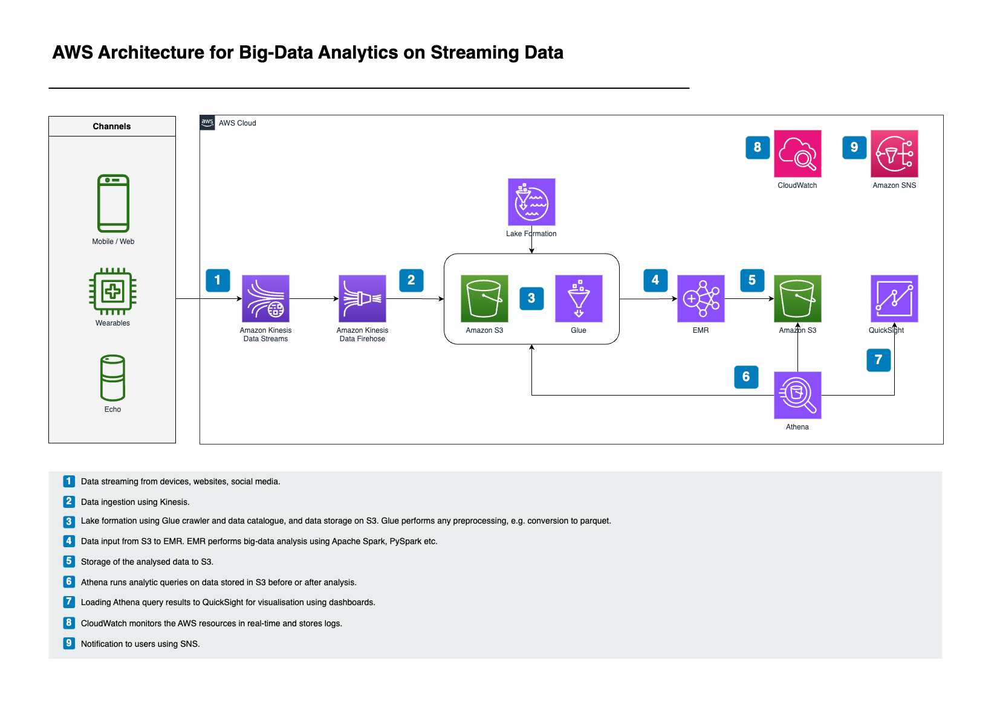

# Big Data Analytics Pipeline with AWS CDK



### Overview

This AWS CDK stack provisions a Big Data Analytics architecture that ingests, processes, stores, and analyzes data at scale using AWS-managed services. The architecture facilitates streaming data ingestion, ETL processing, querying, and visualization, making it suitable for data lake and analytics use cases.

### Key Features

- Real-time data ingestion using Amazon Kinesis Data Streams.
- Data storage in Amazon S3 with lifecycle management.
- ETL processing using AWS Glue.
- Querying and reporting with Amazon Athena and Amazon QuickSight.
- Elastic MapReduce (EMR) for scalable data processing.

### Services and Components

#### 1. Amazon Kinesis Data Streams
- **Purpose**: Handles real-time ingestion of streaming data.
- **Configuration**: Integrated with Amazon Kinesis Firehose for data delivery.

#### 2. Amazon Kinesis Data Firehose
- **Purpose**: Buffers and delivers streaming data from Kinesis Data Streams to an Amazon S3 bucket.
- **Configuration**: Includes transformation logic and compression options.

#### 3. Amazon S3
- **Purpose**: Stores raw and processed data as part of the data lake architecture.
- **Configuration**:
  - Buckets created for raw data, processed data, and analysis results.
  - Lifecycle policies for cost management by transitioning data to lower-cost storage tiers.

#### 4. AWS Glue
- **Purpose**: Manages data cataloging and ETL (Extract, Transform, Load) operations.
- **Components**:
  - **Glue Crawler**: Automatically catalogs the raw and transformed data in S3.
  - **Glue Jobs**: Executes ETL tasks for data transformation.

#### 5. Amazon Athena
- **Purpose**: Provides an interactive SQL query interface to analyze data directly from Amazon S3.
- **Configuration**:
  - Uses the Glue Data Catalog for schema definitions.
  - Configured to query both raw and transformed datasets.

#### 6. AWS QuickSight
- **Purpose**: Visualizes processed data with interactive dashboards and reports.
- **Configuration**:
  - Integrated with Athena for querying data.
  - Provides automated insights and customizable dashboards.

#### 7. Amazon EMR (Elastic MapReduce)
- **Purpose**: Processes large-scale data using distributed computing frameworks like Apache Spark and Hadoop.
- **Configuration**:
  - **Master and core instance types**: m5.xlarge.
  - Integrated with S3 for storing processed data outputs.

#### 8. AWS IAM Roles
- **Purpose**: Grants permissions to services and resources.
- **Roles**:
  - **S3 Access Role**: Allows Kinesis Firehose, Glue, Athena, and EMR to interact with S3 buckets.
  - **Glue Role**: Grants permissions to run Glue crawlers and jobs.
  - **QuickSight Role**: Enables access to Athena and data visualization.

### Architecture Workflow

#### 1. Data Ingestion
- Streaming data is ingested into Kinesis Data Streams.
- Firehose buffers and delivers data to the raw S3 bucket.

#### 2. Data Processing
- Glue ETL jobs transform raw data into a structured format.
- Glue Crawlers update the Data Catalog with metadata.

#### 3. Querying and Analysis
- Athena queries the processed data stored in S3.
- QuickSight visualizes Athena results in dashboards.

#### 4. Scalable Processing
- EMR processes large-scale data using Apache Spark.
- Output data is stored in a dedicated S3 bucket.

### Key Configuration Parameters

- **Instance Types for EMR**: MASTER_INSTANCE_TYPE = 'm5.xlarge', CORE_INSTANCE_TYPE = 'm5.xlarge'.
- **S3 Bucket Names**: Configurable in the CDK stack for raw, processed, and results data.
- **Glue Job Scripts**: Defined and stored in an S3 bucket for execution by Glue jobs.

### Deployment Steps

#### 1. Prerequisites
- AWS CLI and CDK installed locally.
- Bootstrap the environment with `cdk bootstrap`.

#### 2. Deploy the Stack
Run the following commands:

```bash
npm install     # Install dependencies
cdk ls          # List stacks in the app
cdk synth       # Synthesize the cloudformation template
cdk deploy      # Deploy the stack to AWS
cdk destroy     # Destroy the stack
```

#### 3. Post-Deployment Tasks
- Upload Glue scripts to the designated S3 bucket.
- Configure QuickSight to connect with Athena and create dashboards.

---

## **Benefits**

- **Scalability**: The architecture scales automatically with the volume of data.
- **Cost Efficiency**: Uses serverless services like Athena and lifecycle management in S3.
- **Flexibility**: Supports both batch and real-time processing.
- **Integration**: Combines multiple AWS services seamlessly for end-to-end analytics.

